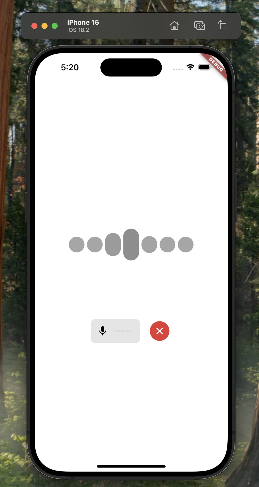

# Flutter Agent Starter

This starter app template for [LiveKit Agents](https://docs.livekit.io/agents/overview/) provides a simple voice interface using the [LiveKit Flutter SDK](https://github.com/livekit/client-sdk-flutter). It supports [voice](https://docs.livekit.io/agents/start/voice-ai/), [transcriptions](https://docs.livekit.io/agents/build/text/), [live video input](https://docs.livekit.io/agents/build/vision/#video), and [virtual avatars](https://docs.livekit.io/agents/integrations/avatar/).

This template is compatible with iOS, macOS, Android, and web. It is free for you to use or modify as you see fit.



## Getting started

First, you'll need a LiveKit agent to speak with. Try our starter agent for [Python](https://github.com/livekit-examples/agent-starter-python), [Node.js](https://github.com/livekit-examples/agent-starter-node), or [create your own from scratch](https://docs.livekit.io/agents/start/voice-ai/).

Second, you need a token server. The easiest way to set this up is with the [Sandbox for LiveKit Cloud](https://cloud.livekit.io/projects/p_/sandbox) and the [LiveKit CLI](https://docs.livekit.io/home/cli/cli-setup/).

First, create a new [Sandbox Token Server](https://cloud.livekit.io/projects/p_/sandbox/templates/token-server) for your LiveKit Cloud project.

Then, run the following command to automatically clone this template and connect it to LiveKit Cloud.

```bash
lk app create --template agent-starter-flutter --sandbox <token_server_sandbox_id>
```

This will create a new Flutter project in the current directory. Install dependencies and run the app:
```bash
flutter pub get
flutter run
```

Note: You may need to configure signing certificates in Xcode if building to a real iOS device.

> [!NOTE]
> To setup without the LiveKit CLI, clone the repository and then either create a `.env` with a `LIVEKIT_SANDBOX_ID` (if using a [Sandbox Token Server](https://cloud.livekit.io/projects/p_/sandbox/templates/token-server)), or modify `lib/controllers/app_ctrl.dart` to replace the `SandboxTokenSource` with your own token source implementation (development-only hardcoded credentials are also supported there).

## Feature overview

This starter app supports several features of the agents framework and is intended as a base you can adapt for your own use case.

### Text, video, and voice input

This app supports:

- **Voice**: send microphone audio to your agent. **Requires microphone permissions.**
- **Text**: send text input using the message bar.
- **Video**: optionally share camera and/or screen share tracks to the room so your agent can process visual input (requires an agent/model that supports it).

Related docs:

- Voice agents: https://docs.livekit.io/agents/start/voice-ai/
- Text: https://docs.livekit.io/agents/build/text/
- Vision/video: https://docs.livekit.io/agents/build/vision/#video
- Screen share: https://docs.livekit.io/home/client/tracks/screenshare/

If you have trouble with screen sharing, refer to the docs linked above for more setup instructions.

### Session

The app is built around two core concepts:

- `livekit_client.Session`: connects to LiveKit, dispatches/observes the agent, and provides a message history via `session.messages` as well as helpers like `session.sendText(...)`.
- `livekit_components.RoomContext` / `MediaDeviceContext`: manages local media tracks (microphone, camera, screen share) and their lifecycle.

### Preconnect audio buffer

This app enables `preConnectAudio` by default to capture and buffer audio before the room connection completes. This allows the connection to appear "instant" from the user's perspective and makes the app more responsive.

To disable this feature, set `preConnectAudio` to `false` in `SessionOptions` when creating the `Session` (see `lib/controllers/app_ctrl.dart`).

### Virtual avatar / agent video

If your agent publishes a video track (for example via a [virtual avatar](https://docs.livekit.io/agents/integrations/avatar/) integration), the app renders the agent's video when available and falls back to an audio visualizer otherwise.

## Token generation in production

In a production environment, you will be responsible for developing a solution to [generate tokens for your users](https://docs.livekit.io/home/server/generating-tokens/) that integrates with your authentication system.

You should replace the `SandboxTokenSource` in `lib/controllers/app_ctrl.dart` with an `EndpointTokenSource` or your own `TokenSourceFixed` / `TokenSourceConfigurable` implementation. You can also use `.cached()` to cache valid tokens and avoid unnecessary token requests.

## Running on Simulator / Emulator

To use this template with video (or screen sharing) input, you may need to run the app on a physical device depending on platform and simulator/emulator capabilities. Testing on Simulator/Emulator will still support voice and text modes.

## Contributing

This template is open source and we welcome contributions! Please open a PR or issue through GitHub, and don't forget to join us in the [LiveKit Community Slack](https://livekit.io/join-slack)!
